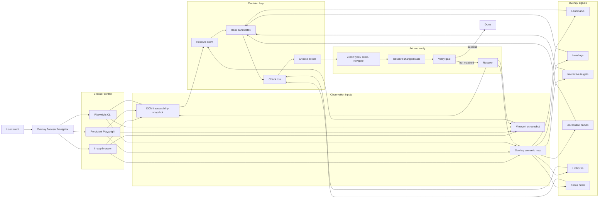

# Workflow

The skill composes three layers:

- browser control: Browser plugin, Playwright Interactive, or Playwright CLI
- observation: DOM/accessibility snapshot, screenshot, and overlay semantic map
- agent policy: intent resolution, ranking, action, verification, and recovery

Use this as a workflow map, not as a mandatory artifact to produce on every
navigation task.

